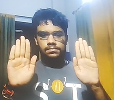
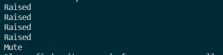

# Syntax Error Project
## Air Guitar 
### **Project Description**
This is a virtual guitar for people who just want to try out, "look cool". It doesn't recquire an indepth knowledge and precision as a regular guitar but just an approximate idea on how the chord should look like (Basically you can literally learn this through the internet)
This has the following dependencies:
- playsound (Used to play music files using python)
- cv2 (Used for inputing computer vision)
- time (Used to determine fps of the project)
- mediapipe (Used hand gesture and tracking identification )
- math(Used in multiple places, mainly to figure out length using hypotenuse function)
### Installation
The installation process will recquire the following pre-requisites to be installed first 
```
pip install opencv-python
pip install playsound==1.2.2
pip install mediapipe
```
then you can clone the repository using git
```
git clone https://github.com/Cyber-Boy/SyntaxError.git 
```
After the installation is complete, run the Callibration.py file. 
### Usage
Initially show your hands in raised manner to the camera so that it can read the size of your hand. Then comes a message "it's now ready to use". 


Then you can make the gesture of whatever chord you want with your left hand and make a strumming motion with your right hand (up or down, your wish)


Now the code will read this and play the appropriate sound. 
### Working
The project first scans your hand for 100 iterations to get an approximate measure for it. The measurements that it takes into regard are the following:
- length of palm
- length from palm base to index tip
- length from palm base to middle finger tip
- length from palm base to ring finger tip
- length from palm base to pinky finger tip
It then takes real time lengths of the above measurements and takes into cosideration the ratio of palm size to finger tip length (this is done to compensate for slight movements that might occur, the ratio will remain approximately constant). 
In guitar chords, when you play strings 5,6, the fingers are not outstretched but a little bent. That is taken into regard by subtracting 0.1 or similar values in necessary places. 
According to the above ratio, each finger is in one of three states: raised, halfway up, down. Using numerous combinations and permutations of the same we have determined which chord to play. 

Now certain chords look similar to each other like A minor and E major, now since the cameras in our phones or laptops are not precise enough to make this distinction, we have used to concept of musical keys. The person selects the key in which he wants to play and only the chords in that key is cross referenced with the fingers positions (again half, raised and down) and the necessary sound is made. 
### Future Prospects
The future prospects of the app includes incorporating a neural network to better judge and read the left hand chords. It also involves incorporating flask framework (could not do it at this moment as that slowed down the project).
